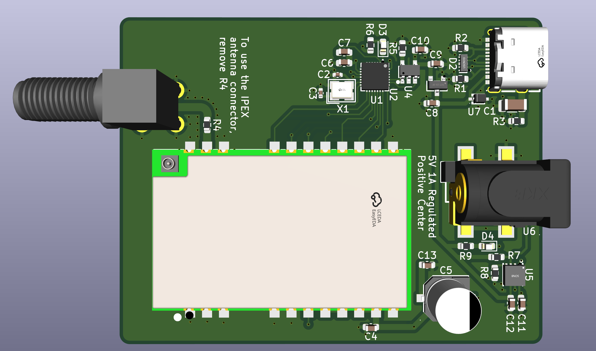

# usb_ch341_e22p

Adaptador **USB → SPI** para usar un módulo LoRa **EBYTE E22P-868M30S** (SX1262 + PA, 30 dBm / 1 W) con **[meshtasticd](https://meshtastic.org/docs/software/linux/)** en un PC o una Raspberry Pi, sin necesidad de GPIO.



El puente es un **CH341F** en modo UIO, que es el que soporta el driver [`libch341-spi-userspace`](https://github.com/meshtastic/libch341-spi-userspace) de Meshtastic. Un multiplexor **TPS2115A** conmuta automáticamente entre la alimentación del USB y la de un jack DC, de modo que el módulo puede transmitir a plena potencia sin sobrecargar el puerto del ordenador.

---

## Especificaciones

| | |
|---|---|
| PCB | 49,22 × 63,54 mm · **2 capas** · 1,6 mm · vías 0,6/0,3 mm |
| Puente USB | CH341F (QFN-28), modo paralelo/síncrono (PID `0x5512`) |
| Radio | EBYTE E22P-868M30S — SX1262 + PA, hasta **30 dBm**, 868 MHz |
| Alimentación | USB-C 5 V **o** jack DC 5 V (2,5 mm), conmutación automática |
| Límite de corriente | 1,28 A nominal (TPS2115A con `R8` = 390 Ω) |
| Lógica | 3,3 V (LDO XC6206), nivel del E22P |
| Antena | SMA hembra acodada, 50 Ω |
| Configuración | EEPROM 24C02 para VID/PID/modo |

## Cómo funciona la alimentación

Es la parte menos obvia del diseño. El E22P consume **600–670 mA transmitiendo a 30 dBm**, más de lo que un puerto USB garantiza (500 mA). La placa resuelve esto con un multiplexor cuya selección es **determinista**, no por comparación de tensiones:

| USB | Jack | `D1` | `D0` | Fuente activa | LED `D4` |
|:---:|:----:|:----:|:----:|---|:---:|
| ✅ | ❌ | 0 | 0 | **USB** — usar potencia reducida | apagado |
| ✅ | ✅ | 1 | 0 | **Jack** — plena potencia | **encendido** |
| ❌ | ✅ | 0 | 0 | ninguna (Hi-Z) | — |
| ❌ | ❌ | 0 | 0 | ninguna (Hi-Z) | — |

`D0` está fijo a masa y `D1` lo gobierna el contacto de conmutación del jack, con `R7` (10 kΩ) referenciado a **VBUS**. Así `D1` codifica *«hay jack **y** hay USB»*, y de ahí salen dos propiedades útiles:

- Con el jack puesto **siempre manda el jack**, independientemente de qué fuente tenga más tensión (las dos filas útiles usan `D0`=0, donde la tabla de verdad del TPS2115A ignora la comparación `IN2>IN1`).
- **Sin USB el módulo queda sin alimentar**, que es lo que se quiere: la placa no sirve de nada desconectada del host, y así se evita que el E22P alimentado inyecte corriente por los pines del CH341 apagado.

El LED `D4` cuelga de `STAT`, que es open-drain y se pone a nivel bajo cuando `IN1` está activo: **encendido = alimentándose del jack**.

## Configuración de meshtasticd

Los pines del CH341 se numeran como líneas UIO `D0`–`D7`. El mapeo de esta placa coincide con el preset oficial `lora-usb-meshtoad-e22.yaml`:

```yaml
Lora:
  Module: sx1262
  CS: 0        # D0 · pin 15 → NSS
  RXen: 1      # D1 · pin 16 → EN   (habilitación del front-end RF)
  Reset: 2     # D2 · pin 17 → NRST
  Busy: 4      # D4 · pin 19 → BUSY
  IRQ: 6       # D6 · pin 21 → DIO1
  spidev: ch341
  DIO2_AS_RF_SWITCH: true
  DIO3_TCXO_VOLTAGE: true
  USB_VID: 0x1A86
  USB_PID: 0x5512
  # Alimentando SÓLO por USB, baja la potencia para no sobrecargar el puerto:
  # SX126X_MAX_POWER: 10
```

`SCK` va en `D3` (pin 18) y `MOSI` en `D5` (pin 20); `MISO` está en `D7` (pin 22), que junto con `D6` es entrada fija en el CH341. `DIO2_AS_RF_SWITCH` es obligatorio: en la placa el pin `DIO2` está puenteado a `T/R CTRL`, tal como indica la nota ① del manual de EBYTE.

> [!IMPORTANT]
> **La EEPROM `U2` debe estar programada** con `MODE = 0x12` para que el CH341 enumere como puerto paralelo/síncrono. Sin programar, el chip lee `SDA`/`SCL` flotantes y arranca como **puerto serie**, no como SPI. Se graba por USB con `CH341CFG` o `IMSProg`.

## Fabricación

Todo lo necesario está en [`fab/`](fab/):

| Archivo | Para qué |
|---|---|
| `gerbers-jlcpcb.zip` | Gerbers + taladros, listo para subir |
| `bom-jlcpcb.csv` | Lista de materiales |
| `cpl-jlcpcb.csv` | Posiciones para montaje |
| `*.gtp` / `*.gbp` | Capas de pasta, por si pides esténcil |

Parámetros: **2 capas, 1,6 mm, HASL o ENIG**. Nada fuera de las capacidades estándar.

### Notas sobre el BOM

- **`U3` (E22P-868M30S) y `SMA1` no tienen código LCSC**: el módulo se compra en EBYTE o en AliExpress, y el conector SMA es genérico. Ambos se sueldan aparte.
- **Los pasivos genéricos no llevan código asignado** (100 nF, 1 µF, 10 µF, y las resistencias). Son valores de stock básico y conviene dejar que el fabricante los elija de su inventario.

## Componentes principales

| Ref | Componente | Función |
|---|---|---|
| `U1` | CH341F | Puente USB ↔ SPI |
| `U2` | 24C02 | EEPROM de configuración (VID/PID/modo) |
| `U3` | E22P-868M30S | Módulo LoRa SX1262 + PA |
| `U4` | XC6206P332MR | LDO 3,3 V para el CH341 |
| `U5` | TPS2115A | Multiplexor de alimentación |
| `U6` | DC-005-2.5A | Jack DC 5 V con contacto de conmutación |
| `U7` | H7VHD3UA | TVS de protección en VBUS |
| `D2` | TPD4E05U06 | Protección ESD del USB (D+/D−/CC1/CC2) |
| `C5` | 470 µF / 16 V | Polímero sólido, 28 mΩ ESR — reserva para los picos de TX |

## Datasheets

No se incluyen los PDF en el repositorio (son material con derechos de sus fabricantes). Enlaces a las fuentes:

- [CH341 (WCH)](https://www.wch-ic.com/products/CH341.html) · [E22P-868M30S (EBYTE)](https://www.cdebyte.com/products/E22P-868M30S) · [TPS2115A (TI)](https://www.ti.com/product/TPS2115A) · [TPD4E05U06 (TI)](https://www.ti.com/product/TPD4E05U06) · [XC6206 (Torex)](https://www.torexsemi.com/products/voltage-regulators/xc6206/)
- Referencias LCSC: `C412870` (CH341F) · `C2863458` (TPS2115A) · `C138714` (TPD4E05U06) · `C20615807` (H7VHD3UA) · `C709357` (USB-C) · `C2880544` (jack) · `C9002` (cristal)

## Limitaciones conocidas

- **Sin protección en la entrada del jack.** No hay TVS ni protección de polaridad inversa en `IN1`. El E22P se daña por encima de 5,5 V y el TPS2115A tiene un máximo absoluto de 6 V: un alimentador de 9 o 12 V, o de centro negativo, destruye ambos. **Usa sólo 5 V y comprueba la polaridad.**
- **La potencia de transmisión no se detecta sola.** meshtasticd no sabe si el jack está puesto, así que `SX126X_MAX_POWER` es un ajuste fijo. Si vas a usar la placa sólo por USB, bájalo.

## Licencia

Sin licencia asignada todavía. Sin una licencia explícita, el contenido queda bajo copyright por defecto y no se concede permiso de uso, copia ni modificación. Si quieres reutilizarlo, abre un issue.
